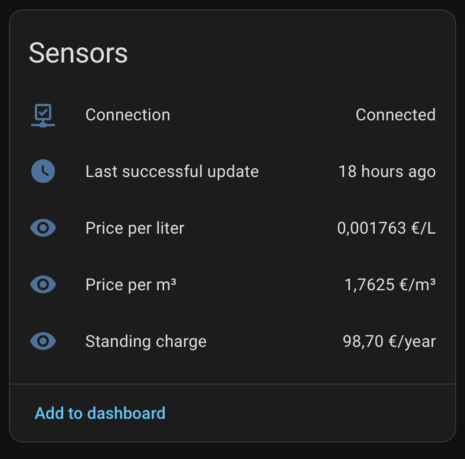

# Home Assistant Waternet

Unofficial Home Assistant integration that reads Amsterdam Waternet drinking-water
tariffs from their public rates page and exposes them as entities in Home Assistant you can use for your Energy dashboard.

It polls once a day. Tariffs usually change on 1 January, so most days the
number will stay the same.

No Waternet account is needed.

## What you get

| Sensor | Unit | Meaning |
|---|---|---|
| Price per liter | EUR/L | Water + BOL + 9% VAT |
| Price per m³ | EUR/m³ | Same price, Energy-dashboard unit |
| Standing charge | EUR/year | Vaste kosten + 9% VAT |
| Last successful update | datetime | Last time Waternet was read successfully |
| Connection | connected/disconnected | Latest daily fetch succeeded |

Price sensors keep the last good value if a later fetch fails. `last_update_successful` goes off in that case.

Attributes on each: tariff year, water €/m³, BOL €/m³, VAT %, standing charge €/year excl. VAT.

The standing charge is **not** folded into the liter price. BOL is only due on
the first 300 m³/year under Dutch law; a normal household stays under that.

2026 example: `(1.18 + 0.437) × 1.09 / 1000 = €0.001763 / L`, vaste kosten `90.55 × 1.09 = €98.70 / year`.

## Install via HACS

1. HACS → Integrations → ⋮ → Custom repositories
2. Add `https://github.com/chekalsky/homeassistant-waternet` as **Integration**
3. Download **Waternet**
4. Restart Home Assistant
5. Settings → Devices & services → Add integration → **Waternet**

## Energy dashboard

If you already have a water-usage sensor, set its cost to **Use an entity
tracking the price** and pick `sensor.waternet_price_per_m3`.

## Source

[Waternet: kosten drinkwater met watermeter](https://www.waternet.nl/service-en-contact/drinkwater/kosten/met-watermeter/)
